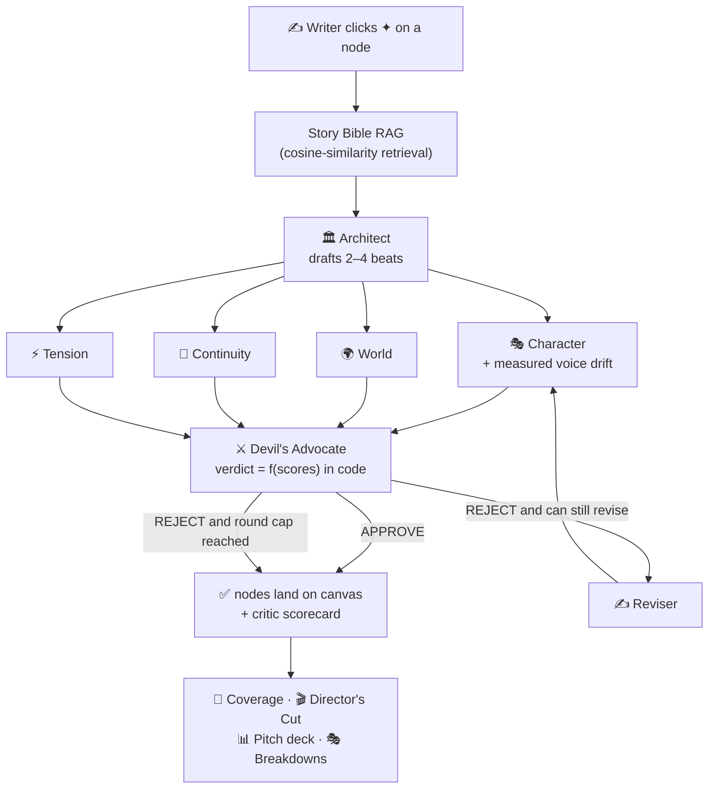
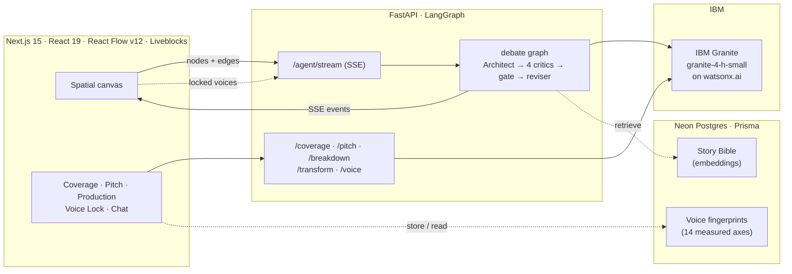

# 🎬 The Writers' Room

> **A spatial canvas where a crew of AI specialists *argues* your story into shape — and you stay in the director's chair.**

[](#-getting-started)
[](https://www.ibm.com/granite)
[](https://www.ibm.com/watsonx)
[](https://www.ibm.com/products/bob)
[](#-how-we-keep-the-ai-honest)

**Built for the [IBM AI Builders Challenge — July 2026](https://www.ibm.com/) · *Creative Industries* track.**

---

## 🎯 Problem Statement

Creative work is squeezed by four forces the challenge brief names directly:

1. **Time-consuming production workflows** — turning an idea into a finished script takes weeks of drafting and revision.
2. **Technical complexity** — screenplay formatting, structure, and continuity are specialized skills with a steep learning curve.
3. **Limited access to advanced tools** — a real writers' room, or a professional *coverage* read, is expensive and gatekept.
4. **The imagination-to-execution gap** — most creators have more ideas than they can finish.

And the dominant "AI writing tool" makes this *worse*, not better. A chatbot hands you **infinite text and zero judgment**. It agrees with everything, forgets your own rules from one turn to the next, produces cliché on demand, and gives you a wall of prose with no structure. It is a **content generator**, not a **creative partner** — and the brief is explicit that the latter is what's wanted.

The hard part was never *generating*. It was knowing **what to keep**, and keeping your world from contradicting itself.

## 💡 Solution

**The Writers' Room** replaces the yes-man chatbot with a *room* that judges. You drop story beats onto an infinite spatial canvas. When you ask for the next beat, a crew of **seven specialist agents** debates it in real time — an Architect drafts, four critics tear it apart (character, world, continuity, pacing), a Devil's Advocate renders a verdict, and a Reviser rewrites until the room approves. You watch the whole argument happen, then accept, reject, or argue back.

Every agent is grounded in a persistent **Story Bible** (a vector-searchable knowledge base of your characters, locations, lore, and rules), so the world stays consistent no matter how far the story grows. And when the room agrees, one click turns the canvas into a **professionally formatted screenplay**, a **producer pitch deck**, a **coverage report**, and **casting/shot-list breakdowns** — the exact artifacts a real production pays for.

### Chatbot vs. The Writers' Room

| | A chatbot | The Writers' Room |
|---|---|---|
| Generates | one voice that agrees | **seven specialists that disagree** |
| Memory of your world | forgets between turns | **Story Bible (RAG)** grounds every agent |
| Quality control | none — you're the only critic | **a visible debate + a deterministic gate** |
| Output | a wall of text | **screenplay · pitch deck · coverage · breakdowns** |
| Your role | prompt engineer | **director** |

---

## ✨ Key Features

### 🎭 The debating agent crew (LangGraph)
A fan-out / fan-in state machine, not a linear chain. The Architect drafts; four critics evaluate *in parallel*; the Devil's Advocate merges their structured scores into one verdict; the Reviser rewrites on rejection (up to 2 rounds). The debate **streams live** as Server-Sent Events, so the UI lights up each agent as it thinks.

| 🏛️ Architect | 🎭 Character Lead | 🌍 World Builder | 🧵 Continuity | ⚡ Tension/Pacing | ⚔️ Devil's Advocate | ✍️ Reviser |
|---|---|---|---|---|---|---|
| drafts beats | voice & arc | lore & rules | plot holes | stakes & rhythm | **the gate** | rewrites |

### 🗺️ Spatial story canvas
Four node types (beats, characters, locations, notes) on an infinite React Flow canvas, connected by **semantic edges** (causes / transitions-to / features / conflicts). AI suggestions arrive as dashed *proposed* nodes you accept or reject. **Each produced node carries a critic scorecard** — the four critics' verdicts rendered as colored dots on the card — so the debate is legible *on the canvas*, not just in a side panel.

### 📖 Story Bible (retrieval-augmented generation)
Add a fact once ("Mira's scar is from a childhood accident") and every agent retrieves the relevant facts by cosine similarity before it speaks. The world can't contradict itself, because the agents are reading from the same canon you wrote.

### 💬 Talk to any agent
Open a conversation with a single agent, in its persona, grounded in the canvas + Story Bible, with full conversation memory. Argue with the Devil's Advocate. Stress-test continuity. Brainstorm with the Architect.

### 🎨 Tone / genre transfer
Rewrite any node as noir, comedy, horror, epic, minimalist, literary, thriller, romance, sci-fi, or high fantasy — **preserving the plot**, transforming only the voice.

### 📝 Coverage report *(the artifact nobody else offers)*
A professional script-reader's verdict on your story: logline, premise, **Recommend / Consider / Pass**, a **1–10 score**, strengths, weaknesses, plot holes, per-character notes, structure, and marketability. This is the $50–150-per-script service a studio buys — generated from your canvas, free.

### 📈 Pacing & tension analytics
A per-beat dramatic-tension curve with structural insights **computed in code**: the model only scores each beat's tension (in the order the backend hands it); the *judgment* — climax placement, whether the peak lands in the back third, the longest "sag" of flat beats, the overall arc shape — is derived deterministically from those numbers. Hand-rolled SVG chart (no chart dependency), climax marker, shaded dead-zones, and a copyable / downloadable Markdown read.

### 🔒 Character voice lock *(the verdict is arithmetic)*
Lock a character's voice from the dialogue they already speak on the canvas. The backend harvests only the lines it can *attribute* to them, then measures **14 style axes in pure Python** — sentence length and rhythm variation, word length, contractions, hedging, intensifiers, first person, vocabulary range, questions, exclamations, interruptions, trailing off. Granite is then allowed to **name** what was measured (register label, signature phrases, vocabulary domain, and the words this character would never say). It never scores a voice.

Any line can then be measured against that fingerprint — **no model call, no tokens, identical every time** — and the panel shows the evidence: the drift score, which axes moved and in which direction, and which axes were *excluded* and why (a line too short to measure diversity honestly says so instead of guessing).

The same arithmetic runs **inside the debate**. The Character Lead measures the crew's own draft against the room's locks before it writes a word of critique, and its verdict is **floored at the measured one** — the model may judge more harshly, but it cannot talk a measured blocker down to an approval. A room with no locks debates exactly as it did before.

The drift score maps to a fixed band, and the band decides — so the threshold is a written-down claim, not a vibe:

| Drift | Band | In a debate |
|---:|---|---|
| 0–17 | `ok` | Approves. Voice has legitimate range. |
| 18–34 | `minor` | Reported in the feedback, **does not** reject. |
| 35–59 | `major` | **Rejects.** A wholesale register change. |
| 60+ | `blocker` | **Rejects.** Or any hard rule broken (a `never_says` word). |

One measured `major` is enough to send a round back even if all four models approved — that is deliberate, and it's pinned by a test that uses a lock with *no* hard rules at all, so nothing but the numbers can be doing the work. The line lives in exactly one place (`severity_rejects` in `app/orchestration/voice.py`) if you'd rather only blockers reject.

### 🎬 Director's Cut + production breakdowns
- **Director's Cut** compiles the graph into a properly formatted screenplay — **PDF** (US Letter, Courier 12pt, real margins), **Fountain**, **Final Draft `.fdx`**, or plain text.
- **Character breakdown sheets** (casting-ready: appearance, arc, key scenes, voice note).
- **Scene breakdowns + shot lists** (slugline, cast, props, suggested shots) — each with a **cinematic image prompt** that's always copyable into any image tool, with optional in-app rendering.
- **Pitch deck**: logline, synopsis, comparable titles, character bios, themes, hook.

### 🤝 Real-time collaboration
Rooms persist (Liveblocks + Postgres) and sync live — collaborators see the same canvas, the same debate, the same cursors. No merge conflicts, no `final_v2_REAL.docx`.

### 🚪 Guided rooms (no cold start)
Open `/room/demo` (or any named room from the dashboard) and it opens **pre-populated** with a themed 3-node story + story-bible facts, so the very first ✦ click demonstrates a real, contextual debate. Genuinely-new rooms stay blank by choice, with a "start from a premise" path.

---

## 🧠 AI Approach & Architecture

The core innovation is the **debate loop**: a structured, multi-agent argument whose verdict is computed *deterministically in application code* from the critics' structured scores — never by asking the model to grade its own work (a model that marks its own homework drifts toward passing; ours can't).



**The full request path:**



**Engineering choices that matter:**
- **Backend-agnostic model layer** — one `MODEL_BACKEND` env var switches between watsonx (demo) and local Ollama Granite (free dev); the agent code never branches on provider.
- **Structured output with retry + JSON-repair** — every model response is parsed against a Pydantic schema; a malformed answer triggers an in-place repair re-prompt, then a graceful fallback, so the demo never blanks.
- **Prompt-injection defense** — every node, fact, and chat message is wrapped in an instruction hierarchy before it reaches an agent, so canvas content is treated as *data to reason about*, never as commands.
- **Deterministic gate** — see "How we keep the AI honest" below.

---

## 🛡️ How We Keep the AI Honest

A creative tool is only a partner if you can trust its judgment. These aren't promises — they're in the code, and they're covered by tests:

1. **The verdict is computed in code.** The Devil's Advocate's APPROVE / REJECT is calculated deterministically from the four critics' structured scores (`merge_agent` / `gate_router` in `agent_graph.py`) — *never* by asking the model to grade its own output. A 2–2 split is treated as meaningful disagreement (→ revise), not silent acceptance.
2. **Every output is schema-validated.** Each model response is parsed against a strict Pydantic schema, with automatic retry and JSON-repair. A malformed answer degrades gracefully instead of crashing.
3. **Your words can't hijack the room.** All user-supplied content is fenced with an instruction hierarchy (`fence_untrusted` in `context.py`) before it reaches an agent.
4. **The high-signal logic is tested without a network.** `api/tests/` pins the gate's deterministic verdicts, the injection fence, the structured-output retry/fallback contract, the topological beat-ordering (cycles, self-loops, disconnected nodes), the code-derived pacing insights, the voice-drift arithmetic, and every response schema — **318 tests, all passing, no network, ~4s.**
5. **Structural judgment is computed, not asked.** The pacing analytics route (`/analytics/tension`) asks the model only for per-beat tension numbers, then derives climax placement, flat-stretch detection, and overall arc shape in `app/orchestration/ordering.py` — the same principle as the debate gate, applied to story structure.
6. **A locked voice is enforced by arithmetic.** Character voice lock measures 14 style axes from a character's own dialogue in pure Python (`app/orchestration/voice.py`). Granite is allowed to *name* the register it finds; it never scores one. During a debate the Character Lead measures the draft against those numbers and **floors its verdict at the measured one** — so a wholesale register change is a REJECT no model can talk down, and a sample too thin to judge is reported as unmeasured rather than guessed at.

---

## 🎨 Challenge Theme Alignment

**Theme: *Creative Industries* — "AI as a creative partner, not a content generator."**

| What the brief asks for | How The Writers' Room answers it |
|---|---|
| *AI as a creative partner* | Agents **debate, critique, and revise** — and you can **argue back** in multi-turn chat. They don't just emit text. |
| *Bridge imagination → execution* | One click from a premise to an **industry-formatted screenplay**, a **pitch deck**, and a **coverage report**. |
| *Storytelling & content-creation tools* | A purpose-built spatial storytelling environment, not a generic text box. |
| *Creative ideation & brainstorming* | The Architect proposes branching directions; tone-transfer re-imagines any scene; the pitch deck synthesizes the whole story. |
| *Multimedia / multimodal* | Live streaming debate, real-time collaborative canvas, cinematic image prompts per scene. |
| *Help creators work faster* | From premise to structured, consistent, exportable draft in minutes, not weeks. |

**Required tech:** IBM Bob (primary dev tool) ✅ · AI as a core component ✅
**Recommended tech used:** IBM Granite ✅ · watsonx.ai ✅ · Python + Node.js + React + Next.js ✅

---

## 🤖 How IBM Bob Was Used

**IBM Bob was the primary development tool** for this project, used end-to-end in VS Code across its Ask, Plan, Code, and Advanced modes:

- **Codebase exploration** — Bob analyzed the starter structure and produced the implementation plan for the agent architecture and the spatial canvas.
- **Spec-driven feature building** — the LangGraph debate loop, the streaming SSE layer, the RAG Story Bible, the coverage/pitch/breakdown generators, and the multi-format export pipeline were built by generating implementation from specs, then reviewing and refining.
- **Debugging** — Bob systematically diagnosed issues (structured-output parsing, SSE framing, React Flow re-render loops, the `AgentState` contract) and proposed targeted fixes.
- **Iteration** — rapid back-and-forth refinement of prompts, schemas, and UI components.

> 📸 *[Add 2–3 screenshots of IBM Bob sessions here: Bob generating the debate graph, Bob planning the export pipeline, Bob debugging the SSE stream.]*

---

## 🛠️ Tech Stack

| Layer | Technology |
|---|---|
| **Generation / critique / coverage / pitch / breakdowns** | IBM Granite · `granite-4-h-small` on **watsonx.ai** |
| **Story Bible embeddings** | IBM Granite embeddings on watsonx.ai (deterministic local fallback offline) |
| **Model platform** | IBM **watsonx.ai** |
| **Agent orchestration** | LangGraph + LangChain (`langchain-ibm`) |
| **Backend** | Python 3.11 · FastAPI · Uvicorn · SSE-Starlette |
| **Frontend** | Next.js 15 (App Router) · React 19 · TypeScript |
| **Canvas** | React Flow (`@xyflow/react` v12) |
| **Real-time** | Liveblocks (collaborative canvas) |
| **Database** | Neon Postgres · Prisma ORM |
| **Auth** | NextAuth v5 (credentials + Google OAuth) + cookie demo mode |
| **Export** | jsPDF (PDF), Fountain, Final Draft XML |
| **Styling** | Tailwind CSS · Framer Motion |
| **Primary dev tool** | **IBM Bob** (VS Code) · uv (Python) |
| **Open stack alongside** | LangGraph · FastAPI · Next.js · React Flow · Liveblocks · Neon · Prisma · Qwen/Wan (DashScope) for scene images |

---

## 🚀 Getting Started

### Prerequisites
- Node.js 20+ and npm
- Python 3.11+ and [uv](https://docs.astral.sh/uv/)
- A PostgreSQL database (we use [Neon](https://neon.tech) — free tier)
- IBM Cloud / watsonx.ai credentials (API key + project ID)

### 1. Clone
```bash
git clone https://github.com/ArpitKumar8649/IBM-Bob.git
cd IBM-Bob
```

### 2. Backend (FastAPI)
```bash
cd api
cp ../.env.example ../.env        # then fill in your watsonx keys
uv sync                            # install dependencies (incl. langgraph, langchain-ibm)
uv run uvicorn app.main:app --reload --port 8000
```
The API runs at `http://localhost:8000` (interactive docs at `/docs`).

### 3. Frontend (Next.js)
```bash
cd web
cp .env.example .env.local         # then fill in your keys
npm install                         # postinstall runs `prisma generate`
npx prisma db push                 # create the database tables
npm run dev
```
The app runs at `http://localhost:3000`.

### 4. Try it
1. Open `http://localhost:3000` and click **"Try the demo — no sign-up"** (sets a demo cookie so you skip the sign-in wall).
2. The room opens **pre-seeded** with a themed story. Click **✦** on a node → watch the 7-agent debate stream live; the produced nodes carry a **critic scorecard**.
3. Open **Story Bible** to add world facts, then **Talk to an agent** to argue with one.
4. Click **Coverage** for a reader's verdict, **Director's Cut** to export the screenplay, **Production** for casting sheets + shot lists, **Pitch Deck** for the pitch.

---

## 🔑 Environment Variables

### `api/.env` (backend)
| Variable | Description |
|---|---|
| `MODEL_BACKEND` | `watsonx` (demo) or `ollama` (local dev) |
| `WATSONX_API_KEY` | watsonx.ai API key |
| `WATSONX_PROJECT_ID` | watsonx.ai project ID |
| `WATSONX_URL` | watsonx endpoint (default `https://us-south.ml.cloud.ibm.com`) |
| `WATSONX_MODEL_ID` | Granite model (default `ibm/granite-4-h-small`) |
| `OLLAMA_URL` / `OLLAMA_MODEL_ID` | local Ollama Granite (dev) |
| `CORS_ORIGINS` | comma-separated allowed origins |
| `WRITERS_ROOM_API_KEY` | optional shared API key for the demo backend |
| `WRITERS_ROOM_DAILY_MODEL_CALLS` | process-wide ceiling on model calls per rolling 24h (default `600`, `0` disables). Reported by `GET /healthz` |
| `DASHSCOPE_API_KEY` | optional — enables in-app scene-image rendering (else the cinematic prompt is shown, copyable) |

### `web/.env.local` (frontend)
| Variable | Description |
|---|---|
| `DATABASE_URL` | PostgreSQL connection string (Neon) |
| `NEXTAUTH_URL` | app URL (default `http://localhost:3000`) |
| `NEXTAUTH_SECRET` | session secret (`openssl rand -base64 32`) |
| `GOOGLE_CLIENT_ID` / `GOOGLE_CLIENT_SECRET` | Google OAuth (optional) |
| `NEXT_PUBLIC_API_BASE_URL` | backend URL the browser calls |
| `NEXT_PUBLIC_LIVEBLOCKS_PUBLIC_KEY` | Liveblocks public key |
| `NEXT_PUBLIC_SITE_URL` | canonical site URL for OG/social metadata |
| `WATSONX_API_KEY` / `WATSONX_PROJECT_ID` | **server-side only** — Story Bible embeddings (`lib/embeddings.ts`); no `NEXT_PUBLIC_` prefix, so the key never reaches the browser. Leave blank to use the deterministic local embedder |
| `WATSONX_URL` / `WATSONX_EMBED_MODEL_ID` | watsonx endpoint + embedding model (default `ibm/granite-embedding-107m-multilingual`) |

---

## 📡 API Reference

### Agent orchestration (FastAPI)
| Method | Endpoint | Description |
|---|---|---|
| `POST` | `/agent/stream` | Stream the live debate as SSE events (`agent_start` / `critique` / `decision` / `nodes` / `done`) |
| `POST` | `/agent/invoke` | Run the debate loop, return approved nodes (JSON) |
| `POST` | `/agent/chat` | Multi-turn chat with a single agent (SSE) |
| `POST` | `/coverage/generate` | Professional coverage report (verdict + 1–10 score) |
| `POST` | `/pitch/generate` | Producer-ready pitch deck |
| `POST` | `/breakdown/characters` | Casting-ready character breakdown sheets |
| `POST` | `/breakdown/scenes` | Scene-by-scene breakdown + shot lists + image prompts |
| `POST` | `/transform/tone` | Rewrite a node in a different tone/genre (SSE) |
| `POST` | `/scene-image/generate` | Render a cinematic image prompt (optional key) |
| `POST` | `/analytics/tension` | Per-beat tension curve + code-derived pacing insights |
| `POST` | `/api/generate` | Stream a single Granite completion |
| `GET` | `/api/model-info` | Report the active model/backend |
| `GET` | `/healthz` | Liveness probe |

### Story Bible (Next.js API routes)
| Method | Endpoint | Description |
|---|---|---|
| `POST` | `/api/bible/facts` | Add a fact (auto-embedded) |
| `GET` | `/api/bible/facts?roomId=` | List a room's facts |
| `DELETE` | `/api/bible/facts?id=` | Delete a fact |
| `GET` | `/api/bible/search?roomId=&q=&k=` | Semantic search (cosine similarity) |

---

## 📁 Project Structure

```
IBM-Bob/
├── api/                          # FastAPI backend
│   ├── app/
│   │   ├── main.py               # app entrypoint, CORS, routers, lifespan
│   │   ├── config.py             # settings (pydantic-settings), backend-agnostic
│   │   ├── security.py           # API key + per-IP rate limiting + shared daily spend ceiling
│   │   ├── llm/
│   │   │   ├── chat_model.py     # backend-agnostic Granite chat model
│   │   │   └── granite_client.py # raw streaming client
│   │   ├── orchestration/
│   │   │   ├── agent_graph.py    # LangGraph debate loop + deterministic gate
│   │   │   ├── personas.py       # 7 agent system prompts
│   │   │   ├── context.py        # spatial context + injection fence
│   │   │   ├── structured.py     # structured output w/ retry + repair
│   │   │   ├── voice.py          # 14-axis voice fingerprint + drift math (no model)
│   │   │   └── ordering.py       # topological ordering + code-derived pacing insights
│   │   └── routes/
│   │       ├── agent.py          # /agent/invoke, /agent/stream
│   │       ├── chat.py           # /agent/chat
│   │       ├── coverage.py       # /coverage/generate
│   │       ├── pitch.py          # /pitch/generate
│   │       ├── breakdown.py      # /breakdown/characters, /breakdown/scenes
│   │       ├── transform.py      # /transform/tone
│   │       ├── scene_image.py    # /scene-image/generate
│   │       ├── analytics.py      # /analytics/tension
│   │       ├── voice.py          # /voice/lock, /voice/check
│   │       └── generate.py       # /api/generate, /api/model-info
│   ├── tests/                    # 318 tests, no network
│   └── pyproject.toml
├── web/                          # Next.js frontend
│   ├── app/
│   │   ├── page.tsx              # landing (hero · honesty section · IBM-tech block)
│   │   ├── dashboard/page.tsx    # writer's command center (themed rooms)
│   │   ├── room/[id]/page.tsx    # the canvas room
│   │   ├── signin/ signup/       # auth pages
│   │   ├── pricing/page.tsx
│   │   └── api/                  # NextAuth + Story Bible + voice-lock routes
│   ├── components/
│   │   ├── canvas/               # canvas, agent dock, chat, bible, pitch,
│   │   │                         #   coverage, production, transform, export,
│   │   │                         #   voice lock, tension/pacing chart,
│   │   │                         #   story-card node (critic scorecard)
│   │   ├── landing/              # navbar, footer, vapour accent, demo button
│   │   └── ui/                   # sign-in card, vapour effect, toast
│   ├── public/                   # banner.svg (1920×600) + og-image.svg (1200×630, OG/social)
│   ├── lib/                      # api, bible, voice, pitch, coverage, breakdown, analytics, embeddings
│   ├── hooks/                    # useStoryRoom (Liveblocks storage)
│   ├── prisma/schema.prisma      # User, Room, StoryNode, StoryFact (embeddings), VoiceFingerprint
│   └── middleware.ts             # auth + cookie demo mode
├── docker-compose.yml            # one-command local stack (db + api + web)
├── render.yaml                   # backend deploy (Render)
├── web/vercel.json               # frontend deploy (Vercel)
├── .github/workflows/ci.yml      # lint + test + build on push
├── DEMO_VIDEO_SCRIPT.md          # ≤3-min demo script
└── README.md
```

---

## 🗺️ Roadmap

**Shipped**
Debate loop (7 agents, LangGraph, streaming SSE) · spatial canvas (4 node types, semantic edges, on-node critic scorecard) · Story Bible (RAG) · multi-turn agent chat · tone/genre transfer · **coverage report** · **character voice lock (14-axis fingerprint, enforced by the Character Lead in code)** · pacing/tension analytics chart · Director's Cut (PDF/Fountain/FDX/text) · pitch deck · character + scene/shot-list breakdowns · cinematic image prompts · auth + cookie demo mode · real-time collaborative canvas · guided seed rooms · 318 no-network tests · CI · Docker Compose · deploy configs.

**Post-challenge (ambition)**
Version history (canvas snapshots) · mobile-responsive canvas · PWA/offline · billing (Stripe) · collaboration suite (comments, approvals, @mentions) · integrations (Notion, Google Docs, Slack) · accessibility audit (WCAG 2.1 AA) · i18n · template marketplace · multi-format story support (novel/comic/game).

---

## 👥 Team

**The Writers' Room** — built for the IBM AI Builders Challenge (July 2026).

- *[Your name]* — *[role]*
- *[Teammate]* — *[role]*

---

## 📄 License

[MIT](./LICENSE) © 2026 The Writers' Room.

---

<div align="center">

**Made with 🤖 IBM Bob · Powered by IBM Granite on watsonx.ai**

*From a single premise to a structured, consistent, exportable screenplay — with an AI crew that fights for your story.*

</div>
